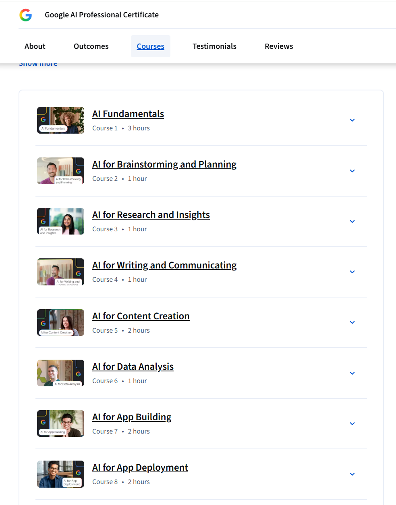
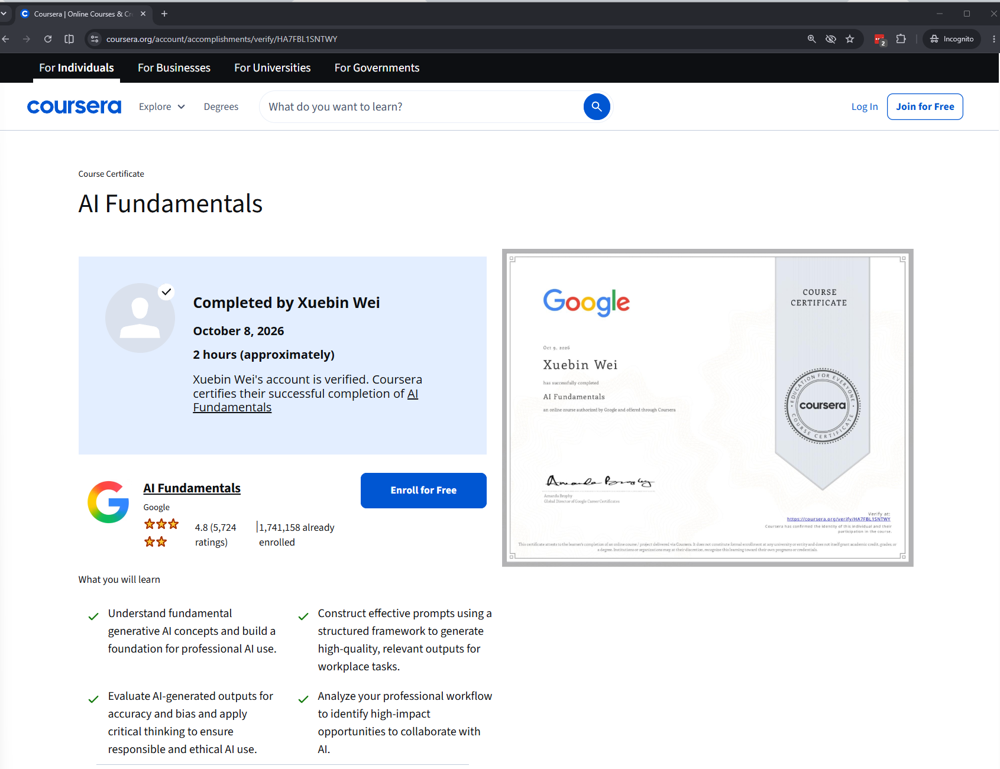
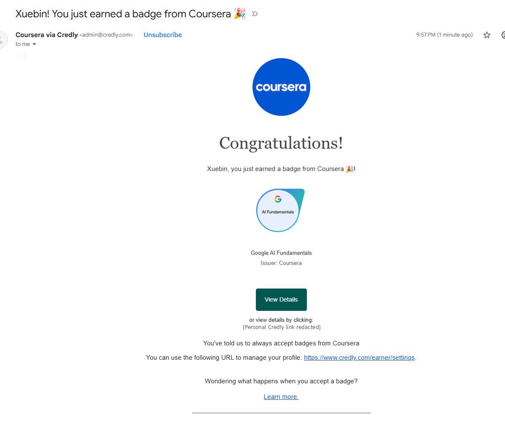

# Google AI Professional Certificate — Course Completion Assignment

**IA340 · Fall 2026 · 100 Canvas points · 10% of the final course grade**

**Deadline:** Follow the **due date and time shown in Canvas**. Complete the courses and submit the verification URLs by that deadline. **Late work is not accepted.**

## Your assignment

Enroll in the **[Google AI Professional Certificate](https://www.coursera.org/professional-certificates/google-ai)** on Coursera through the **[JMU Google Learning Program for JMU IA Students](https://www.coursera.org/programs/google-learning-program-for-jmu-ia-students-j6l6g)**. Complete **at least three different courses** in this eight-course certificate series for full credit.

**Important distinction:** The Professional Certificate consists of **eight courses** (sometimes called "modules" informally). Each course has its *own* internal learning modules. For this assignment, completing one entire **course** earns credit; completing three internal modules of a single course does **not** count as three courses.

### Recommended learning order

We recommend completing the first three courses **in order**:

1. **AI Fundamentals**
2. **AI for Brainstorming and Planning**
3. **AI for Research and Insights**

You may instead choose **any three distinct courses** in the same Google AI Professional Certificate series. All eight eligible courses are listed below.

| Course | Title |
|---|---|
| 1 | AI Fundamentals |
| 2 | AI for Brainstorming and Planning |
| 3 | AI for Research and Insights |
| 4 | AI for Writing and Communicating |
| 5 | AI for Content Creation |
| 6 | AI for Data Analysis |
| 7 | AI for App Building |
| 8 | AI for App Deployment |

**Example 1 — The Google AI Professional Certificate contains eight separate courses:**

## Step 1 — Enroll through the JMU Coursera program

1. Sign in to Coursera with the **Coursera account registered using your JMU email address** and used for the JMU learning program.
2. Open the **[JMU Google Learning Program](https://www.coursera.org/programs/google-learning-program-for-jmu-ia-students-j6l6g)** and enroll in the **Google AI Professional Certificate**.
3. Complete at least three **entire courses** in this specific certificate series, including all activities required for the corresponding **individual course completion certificates**.
4. If Coursera does not show your JMU program access or requests an unexpected personal payment, **contact the instructor before purchasing anything**.

**Google AI Professional Certificate ≠ Google AI Pro subscription.** The certificate program on Coursera is required for this assignment; a separate paid **Google AI Pro** subscription is **not** required.

## Step 2 — Find your individual course certificate URLs

After each **course** is completed:

1. Open **Coursera → Accomplishments** (or the course's completed certificate).
2. Open the **individual course certificate**, not merely the eight-course program overview.
3. Copy its **public verification URL**, typically beginning with `https://www.coursera.org/account/accomplishments/verify/`.
4. Confirm the certificate verification page shows **your name**, the **correct course title**, and the **completion date**.

**Example 2 — Public verification page for an individual course certificate (instructor example):**

**Instructor's sample verification URL (for reference only):**

[AI Fundamentals — Sample Coursera Course Certificate](https://www.coursera.org/account/accomplishments/verify/HA7FBL1SNTWY)

**Do not submit the instructor's sample URL.** Your links must verify *your own* certificates.

### Optional emails: Coursera course certificate and Credly badge

After completing a course, you **may receive separate emails**:

- **Coursera** may notify you that your individual **course certificate** is available. You can optionally share that credential on LinkedIn.
- **Credly** may send a separate digital **badge** notification (for example, the Google AI Fundamentals badge issued by Coursera). You can optionally add this badge to LinkedIn as well.

**For this assignment, submit ONLY your individual Coursera course certificate verification URLs (the `coursera.org/account/accomplishments/verify/...` links) to Canvas.** Do **not** submit Credly badge links, badge emails, badge screenshots, or LinkedIn posts. A Credly badge does not count as an additional completed course, and claiming or sharing it is **not required**.

**Example 3 — A separate Credly badge notification (instructor example; not a Canvas submission):**

For optional badge sharing, visit [Credly](https://www.credly.com/). Do not reuse the instructor's personal badge link shown in the example.

### Test every URL in a private/incognito window

1. Copy each verification URL.
2. Open a **new private/incognito window** where you are **not signed in to Coursera**.
3. Paste the URL. Ensure the certificate is visible **without requiring a Coursera login**, and that the name, course title, and completion date match your work.
4. If the URL does not work publicly, resolve the problem **before submitting it to Canvas**. An enrollment link, course home page, screenshot, LinkedIn post, or private Accomplishments page is **not** a substitute.

## Step 3 — Submit your verification URLs in Canvas

Use the **Text Entry** field of this Canvas assignment. Paste **one distinct course certificate verification URL per line**. Submit **three valid URLs** for full credit.

- **One completed course:** submit its one valid URL for partial credit.
- **Two completed courses:** submit the two valid URLs for partial credit.
- **Three or more completed courses:** submit **three valid URLs** for full credit. You may include more, but only three are required.

If you finish another course before the deadline, **resubmit the full updated set** of your verification URLs in Canvas. The latest on-time submission is used for grading. Do **not** submit only the newest URL while omitting earlier ones.

**Both the completed courses and the Canvas URL submission must meet the deadline shown in Canvas.** Only distinct completed courses from this certificate series with verifiable individual course certificates count.

## Grading — 100 Canvas points (10% course weight)

| Valid individual course certificate URLs | Canvas points |
|---|---:|
| 0 | 0 / 100 |
| 1 | 30 / 100 |
| 2 | 60 / 100 |
| **3 or more** | **100 / 100** |

This assignment has **100 possible points in Canvas**; the **Google AI Professional Certificate** grading category contributes **10% of the overall IA340 course grade**. The 30/60/100 figures are **Canvas points**, not direct percentages of your final course grade.

## Optional — Share your credentials

You may add your verified Coursera course certificates **and/or Credly badges** to LinkedIn, your résumé, or a professional portfolio. This is **optional** and earns no additional points. **You must still submit the individual Coursera course certificate verification URLs—not Credly badge links—in Canvas.**

[Return to the IA340 course home](../../)